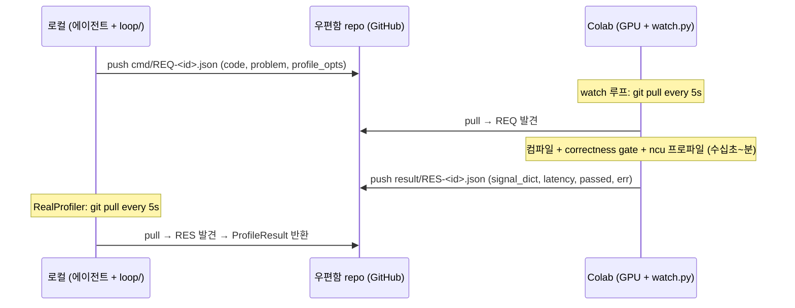

# Git-우편함 Runner — 비동기 GPU 실행 채널

> 🧭 자동 루프의 **Runner 컴포넌트** 설계. 터널·SSH·URL복붙 전부 제거.
> 로컬(에이전트)과 Colab(GPU)이 **git repo를 우편함**으로 cmd/result JSON 교환.
> 근거: [[2026-06-22-agentic-gpu-optimizer-design]] §2 컴포넌트3(Profiler/Submit). [[01-hard-loop-poc]] 터널 운용 교훈.

## 왜 (선택 기록)

이전 = cloudflared SSH 터널 + `colabrun` 래퍼. 3가지 고통:
1. **터널 끊김 로그 노이즈** — cloudflared 경고가 stdout 오염 (실제 끊김은 드묾, 로그만 거슬림).
2. **세션마다 새 URL 복붙** — Colab 재시작 → 새 trycloudflare URL → `~/.ssh/config` 수동 갱신.
3. **배포 불가** — 터널 셋업·URL은 개인 환경 종속. "남들도 쓰는 방법"이 목표라 부적합. Drive 마운트도 보안상 기각.

→ **B+ 결정**: 자동 루프 채널은 git 우편함(비동기). 수동 탐색은 ssh 별도 병존(선택).

### 기각된 대안

| 대안 | 기각 이유 |
|---|---|
| A+ (터널 유지 + URL 자동주입) | 터널 끊김 잔존. URL 자동화해도 터널 셀 살아야. 배포 시 터널 셋업 전파 부담. |
| Drive 파일 폴링 | 개인 Drive 로컬 마운트 = 보안 이슈 + 배포 불가. |
| named tunnel (고정 URL) | Cloudflare 계정·도메인 필요 = 배포 장벽. |

## 핵심 통찰

- **"연결"이 없음.** 실시간 ssh 세션 부재 → "끊김" 개념 소멸. 우편함에 편지 넣고 상대가 확인하는 시차만 존재.
- **즉답성 손실 ≈ 0.** 라운드 본체(컴파일+ncu+벤치) = 수십초~분. 폴링 지연 = ≤폴링간격(5s). 비율상 무시.
- **Colab watch = 새 부담 아님.** 터널 방식도 Colab 셀(터널) 켜둬야 함. watch 셀로 바뀔 뿐 = 순증 0. watch가 셀을 active 유지 → 유휴 90분 끊김 오히려 **방지** (12h 한계만 남음).

## 아키텍처



### 우편함 repo 레이아웃 (코드 repo와 분리)

```
gpu-mailbox/              # 별도 repo. loop/ 코드와 안 섞음.
  cmd/      REQ-<uuid>.json     # 로컬이 push, Colab이 소비
  result/   RES-<uuid>.json     # Colab이 push, 로컬이 소비
  done/     <uuid>              # 처리완료 마커 (재처리 방지)
  .gitignore
```

분리 이유: 코드 repo에 수백 개 cmd/result JSON 커밋 → 히스토리 오염. 우편함은 **휘발성 메시지큐**, 코드는 영속. 생명주기 다름 → repo 분리.

### 메시지 스키마

```jsonc
// cmd/REQ-<uuid>.json  (로컬 → Colab)
{
  "id": "<uuid>",
  "problem": "llama_ffn",          // challenge 식별자
  "code": "<생성된 커널 소스>",
  "code_hash": "ab12cd34ef",
  "profile_opts": {"ncu": true, "metrics": ["sm__throughput", "dram__throughput"]}
}

// result/RES-<uuid>.json  (Colab → 로컬)
{
  "id": "<uuid>",
  "passed": true,                  // correctness gate
  "max_abs_err": 3.1e-6,
  "signal_dict": {"bw_pct": 0.48, "weight_pct": 0.027, "tensorcore_active": true, "latency_us": 857.0},
  "latency_us": 857.0,
  "error": null                    // 컴파일/런타임 실패 시 메시지
}
```

`signal_dict` = `signals.from_dict` 입력과 동일 계약 → 기존 Trace Parser·Hypothesis Engine 그대로 소비.

## 컴포넌트 매핑 (glue.py)

`glue.py`의 3 Protocol = 우편함이 채움:

| Protocol | FakeGlue (현재) | 우편함 구현 |
|---|---|---|
| `Generator.generate` | 스크립트 | `RealGenerator` (LLM API, 로컬측 — 우편함 무관) |
| `Gate.check` | 스크립트 | Colab측 watch가 reference_impl 비교 → result.passed |
| `Profiler.profile` | 스크립트 | **`MailboxProfiler`** ← 핵심. 아래 |

```python
# 로컬측. glue.Profiler 구현. code → REQ push → RES pull → ProfileResult.
class MailboxProfiler:
    def __init__(self, mailbox_dir, poll_s=5, timeout_s=600):
        self.mb, self.poll, self.timeout = mailbox_dir, poll_s, timeout_s

    def profile(self, code, problem) -> ProfileResult:
        rid = uuid4().hex
        _write(self.mb/"cmd"/f"REQ-{rid}.json", {...code, problem...})
        _git(self.mb, "add -A && commit -qm req && push -q")
        res = self._await_result(rid)        # poll git pull until RES-<rid> appears
        return ProfileResult(res["signal_dict"], res["latency_us"])
```

Gate도 같은 RES에 실어 옴(passed/max_abs_err) → 별도 왕복 불필요. 1 cmd = 1 result에 gate+profile 합침.

## 보안 / 배포

- **PAT scope = repo 한정.** 로컬·Colab 양쪽 PAT 필요. Colab은 **Colab Secrets**에 저장(노출 안 됨). Drive 마운트 불요.
- **배포 = repo fork 1개.** 사용자가 빈 우편함 repo 1개 만들고 양쪽에 PAT 꽂으면 끝. 개인 환경 종속 0.
- 우편함 repo private 권장(생성 커널 코드 노출 방지).

## 완료 / 미해결

**완료** (2026-06-24):
- [x] `mailbox.py` `MailboxProfiler` (로컬측) — sync_fn 주입, GPU·git·네트워크 0 self-check PASS. 커밋 `5348fd6`.
- [x] `watch.py` 골격 (Colab측) — 폴링/멱등/실패격리 self-check PASS. `execute_request`만 stub. 커밋 `1889a17`.
- [x] git 충돌 회피 — cmd/ vs result/ 분리로 구조적 무충돌 (설계 확정).
- [x] **배관 왕복 실환경 실증 PASS** (2026-06-24). 로컬 push `REQ-smoke01` → Colab watch `git pull` → `execute_request`(stub) → `RES-smoke01.json` push → 로컬 pull 확인 = 완전 1왕복. 스키마 계약(`id/passed/signal_dict/latency_us/error`) 정상, `done/smoke01` 멱등 마커 동작, 실패 격리(NotImplementedError → error RES, watch 안 죽음) 확인. **배관 굴러감 증명 완료** — 남은 건 `execute_request` 실구현(진짜 GPU 작업)뿐.
  - 운용 메모: `watch.py`는 repo 루트 아니라 `loop/watch.py`. Colab 셀은 `cd .../loop` + `sys.path`에 `/loop` 추가 필요.

- [x] **`execute_request` 실구현 + 진짜 라운드 실증 PASS** (2026-06-24). `executor.py` 신설:
  cmd["code"](전체 solve.py) → `_load_solve_module` → `_run_gate`(solve.py `_reference`
  교차검증, seq=[1,4,128,2048], atol 1e-3) → gate PASS 시 `_profile_ncu`(NCU_METRIC_MAP
  메트릭 → `signals.parse_ncu_rows`), ncu 부재 시 `_profile_event` fallback. `watch.py`는
  executor 위임(lazy import). 커밋 `d2d9644`.
  - **실측 RES-real01** (Colab A100, ncu 권한 OK): `passed=true`, `max_abs_err=2.87e-4`(<atol),
    `signal_dict={bw_pct:0.524, compute_tput:0.031, occupancy:0.409, tensorcore_active:false,
    latency_us:10368}`, `weight_pct=1.0`. **gate·ncu·스키마 전부 정상** = 측정 파이프 완성.
  - ⚠️ **검증점 주의 — latency 단위**: ncu `gpu__time_duration.sum`=10.4ms(커널합, replay 직렬화)
    ≠ 수동 PoC Event e2e=0.84ms([[01-hard-loop-poc]] R5). **버그 아님, 측정법 차이.** 룰/게이트는
    비율 신호(bw_pct·tensorcore_active)로 판단하지 절대 latency 아님 → 파이프 유효. e2e 비교
    필요 시 executor에 Event 측정 추가(미구현, 현 PoC 불요).
  - ✅ **ncu 병목 해소 — `--launch-count 1`** (2026-06-24, 커밋 `08b328b`). 측정으로 주범 격리:
    baseline 32.6s(55커널) vs **launch-count1 5.7s(6배↓)** vs metrics3 29.9s(거의 무변). **주범 = 커널당
    replay 횟수, 메트릭 수 아님.** nsys 전환은 기각 — rules.py 7룰 중 6개가 ncu 전용 신호(bw_pct·
    tensorcore_active·load_eff·occupancy 등) 의존 → nsys(시간만)면 룰 6/7 죽음(특히 R5 핵심 `fp32_no_
    tensorcore`). `--launch-count 1`은 룰 신호 8개 전부 유지하며 6배 단축. 정밀도 약간↓(표본1)이나 PoC 충분.

- [x] **A 인프라 — `runner.py` (로컬측 자동 루프) 코드 완성** (2026-06-24, 커밋 `8541351`).
  `MailboxGlue` 어댑터 = harness glue(generate/check/profile)를 `MailboxProfiler.submit` 1왕복에
  매핑(check+profile 캐시로 중복 왕복 방지). `FixedGenerator` = generate stub(solve.py 고정,
  LLM은 후속). `run_problem(problem, seed_code, mailbox_dir, ledger_path, sync_fn, ...)`.
  **self-check PASS** (fake 우편함, GPU·git·LLM 0): signal→match→evolve 흐름 4라운드 수렴, evolve
  이벤트 4개. **단일문제 배관 연결 검증됨** — 다문제 차별점은 문제 입수 후.

**미해결**:
- [ ] PAT 주입 표준화 (env var `GPU_MAILBOX_TOKEN`, Colab Secrets).
- [ ] 재시도 정책 (현재 timeout→MailboxTimeout 예외까지만, 재큐 미구현).

## ✅ A 인프라 e2e 검증 PASS (2026-06-25)

> **완료.** 로컬(CPU) ↔ Colab(A100) 완전 자동 왕복 실증. 터널 0, git 우편함만.

**실증 라운드** (REQ `07c415ce`, problem=`solve_llama`, seed=현 챔피언 solve.py 10652자):
- 로컬 `run_e2e.py` → `run_problem` → REQ push → Colab watch pull → executor(gate+ncu) → RES push → 로컬 pull → ledger 기록 → 룰 발화. **1왕복 완결.**
- 결과: `rounds=1 stop=stop_label events=1 passed=True max_abs_err=2.87e-4`(<atol).
- `signal_dict`: `occupancy 0.582 · l2_hit 0.987 · bw_pct 0.0003 · compute_tput 0.631 · tensorcore_active true · weight_pct 1.0 · latency_us 24288`.

**검증점 — 신호가 챔피언 변천을 정확히 반영** (RES-real01과 정반대 = 버그 아님):
| | RES-real01 (pre-TF32 코드) | e2e (현 챔피언 `9e09b9b` flash4d+TF32) |
|---|---|---|
| tensorcore_active | false | **true** |
| compute_tput | 0.031 | **0.631** |
| bw_pct | 0.524 | 0.0003 |

real01은 TF32 켜기 전 측정. 현 챔피언은 R5에서 TF32 적용(sgemm→텐서코어) → `tensorcore_active false→true`, `compute_tput` 폭증은 **TF32 효과 그대로**. 코드 바뀌니 신호도 맞게 바뀜 = 측정 파이프 정확성 증거.

**운용 확정 사항**:
- 브랜치: **mailbox=`main`**, loop=`master` (서로 다름 — sync_fn은 main 사용). `run_e2e.py` `BRANCH="main"`.
- PAT: **Colab Secrets `GPU_MAILBOX_TOKEN`** (userdata.get, 평문 0). notebook은 `gpu-solver-loop`에 push(`.gitignore` `*.ipynb` 예외 `-f`).
- prior blocker(git pull 실패) 해소: clone URL에 PAT 임베드 + `git config user.*` 매 실행 재설정. 헬스체크 셀 RC:0 확인.
- 로컬 e2e 드라이버: `loop/run_e2e.py` (진짜 git sync_fn = add→commit→pull --rebase→push).

**남은 것 (차별점 = 별개 큰 작업)**:
- [ ] **다문제 GT 실험** — LeetGPU easy/middle 문제로 evolver 룰 진화 관찰(공개 재료). 단일문제는 배관만, 룰 content 진화 안 일어남.
- [ ] LLM generate (현 FixedGenerator stub) → RealGenerator.
- [ ] 재시도 정책 (timeout→재큐 미구현).

---

## 🔖 (구) 재개 지점 (2026-06-24 — 위에서 해소됨)

> A 인프라 코드 전부 완성·push됨. 막힌 건 **Colab watch의 git pull 실패** 1건 — 2026-06-25 해소.

### 지금까지 (전부 push 완료, loop repo `gpu-solver-loop` master)
- 통신(우편함) ✅ · 측정(ncu `--launch-count 1`, 6배↓) ✅ · A 인프라 코드(`runner.py`) ✅
- 최신 커밋: `8541351`(runner.py). executor `08b328b`, watch `d2d9644`.

### 막힌 지점 — Colab watch `git pull` 실패 (진단 미완)
증상: Cell 4 `watch.watch_loop` → `git_sync_push` → `git -C /content/gpu-mailbox pull -q --no-edit`
→ `CalledProcessError non-zero exit`. watch가 예외 잡고 계속 재시도 → 같은 에러 도배.
- **import는 통과** (watch 시작됨). reload 제거한 깨끗한 Cell 4(`import watch`만)면 import OK.
- **PAT 토큰은 살아있음** (user 확인) → 인증 문제 아님.
- **remote `gpu-mailbox` 정상** (빈 우편함, history 정상). divergent 아님.
- **유력 원인**: Colab clone 후 `git config user.email/name` 미설정 → pull이 머지 ident 못 만들어 실패.
  (Cell 2가 `git config --global user.*` 하지만 런타임 재시작 시 휘발 → Cell 2 미재실행이면 날아감.)
- **진단 미완**: watch.py `_git`이 `capture_output=True`라 stderr 삼킴 → 에러 전문 못 봄.

### 재개 절차 (다음 세션 첫 순서)
1. **stderr 확보** — Colab 임시 셀:
   ```python
   import subprocess
   r = subprocess.run(["git","-C","/content/gpu-mailbox","pull","--no-edit"],
                      capture_output=True, text=True)
   print("STDERR:", r.stderr); print("RC:", r.returncode)
   ```
   STDERR가 진범 확정 (user 미설정 / 인증 / 기타).
2. **user 미설정이면** — Colab 셀에서:
   `!git config --global user.email "colab@gpu-solver" && git config --global user.name "colab-watch"`
   (또는 Cell 2 통째 재실행 — 거기 user config 있음.)
3. **watch 재기동** — Cell 4(`import watch` + `watch.watch_loop(MB, poll_s=5, max_iters=120)`).
   reload 전부 제거(노트북 import서 `from . import` 충돌 유발).
4. **로컬 runner 실행 (= 에이전트)** — watch 살아있으면 에이전트가 로컬서:
   `run_problem("solve_llama", <solve.py 텍스트>, "<mailbox clone>", "<ledger.jsonl>", sync_fn=git_pull_push)`
   → REQ 자동 push, RES 자동 pull, signal→match→evolve. **= A 인프라 e2e 검증.**
5. **검증점**: ledger에 라운드 기록 + RES.signal_dict가 RES-real01(bw_pct 0.524 등)과 일치 → 배관 정확.
   고정코드라 metric 정체 → 빠른 수렴. evolver는 confidence ±1만(단일문제). **차별점(룰 폐기·후보)은 다문제.**

### 그 다음 (e2e 검증 후)
- **다문제 차별점 실험** — user가 LeetGPU easy 1 + middle 1 가져옴(준비 중). 각 문제 = reference_impl +
  입력생성 + solve 시드. challenge 포맷 맞춤 → 다문제 라운드 = evolver 룰 진화 관찰 = **공개 재료**.
- **B(통신 편의)** — PAT→Colab Secrets, 셀 합치기. 비핵심, 막판.
- 비용: A 본체(실험 디버깅)는 토큰 큼. 1차 공개 전까진 에이전트가 수행(user 승인).

### 운용 메모 (재발 방지)
- Colab Cell 4는 `import watch` 1줄만 (reload·`import executor,signals` 제거 — 노트북 import 충돌).
- `watch.py`는 `loop/` 하위 → `sys.path`에 `/content/gpu-solver-loop/loop` 필요.
- watch git pull 실패 시 watch는 안 죽고 재시도(도배) → 멈추려면 셀 정지.
- `colab_mailbox.ipynb` = watch 전용. 측정·실험 셀 넣지 않음(별도 임시 셀, 폐기).
- [ ] `mailbox.MailboxProfiler` 로컬측 ↔ ledger/harness/evolver 연결 (signal_dict → 자동 루프 본체).

## 다음 세션 착수 체크리스트 (우편함 repo 생성 + 첫 자동 라운드)

> 재논의 0으로 바로 시작하도록 순서·재료 박음. 목표 = **배관 실증 1문제** (challenge.py 1개로 자동 라운드 1회 = 우편함 왕복 + ncu 실측이 굴러감 증명). 차별점 실험 아님.

**선결 확인됨**: `gh` 인증 OK(alexxony) · `challenge.py`(reference_impl) + `solve.py`(현 챔피언 flash4d+TF32) 존재 = execute_request 재료 있음.

**순서**:
1. **우편함 repo 생성** — `gh repo create gpu-mailbox --private`. cmd/ result/ done/ + .gitignore 초기 커밋. 로컬 clone 1개.
2. **PAT 표준화** — `GPU_MAILBOX_TOKEN` env. 로컬은 gh 토큰 재사용, Colab은 Secrets에 동일 PAT.
3. **`execute_request` 채움** (Colab) — cmd["code"]→파일 → `challenge.py` reference_impl과 `torch.allclose(atol=1e-3)` gate → 통과 시 `ncu --metrics ... --csv` → `signals.parse_ncu_rows`로 signal_dict + weight_pct(단일커널이면 1.0) → RES 스키마.
4. **Colab watch 띄움** — `!python watch.py --loop --mailbox /content/gpu-mailbox --poll 5`. (watch가 셀 active 유지 → 유휴 끊김 방지)
5. **로컬서 첫 라운드** — `MailboxProfiler(mailbox_dir, sync_fn=git_sync_pull)`로 solve.py 코드 1개 submit → RES 수신 검증. **= 첫 자동 라운드.** signal_dict가 ledger에 들어가면 harness/evolver가 그 위에서 굴러감.

**검증점**: RES.signal_dict가 수동 PoC([[01-hard-loop-poc]] §R5) 챔피언 측정(flash4d+TF32, bw_pct·tensorcore_active 등)과 **일치**하면 배관 정확. 불일치 = ncu 파싱/스키마 버그.

**경계**: 이건 **배관 실증**(1문제). 차별점 실험(다문제 GT)은 별개 큰 작업 — 배관 굴러간 뒤 [[GPU-Solver-MOC]] 다음 항목.

## 의사결정 여정 (이 설계에 도달한 과정)

> 결론(위)만으론 "왜 터널 안 고치고 버렸나"가 안 보임. 논의 순서 기록 = 미래의 나/타인이 같은 길 재탐색 안 하도록.

### 1단계 — 터널 끊김 = 진짜 문제인가?

최초 신고: "cloudflared 터널 자주 끊김 + 세션마다 URL 복붙 귀찮음."

**스코프 먼저**(ponytail 사다리: 문제 존재 확인 → 한 줄로 되나 → 그제서야 재설계). 끊김 종류 구분:
- 터널만 죽음(런타임·변수 생존) vs 런타임 죽음(전체 사망). 구분 테스트 = `colabrun "echo alive && nvidia-smi -L"` 즉답이면 둘 다 생존.

**판명**: 런타임 안 죽음. 터널도 사실상 안 죽음. 너가 본 "끊김 로그" = **내가 ssh 돌릴 때 뜬 cloudflared 재연결 경고 메시지**(stdout 오염), 실측 지연 0 = **노이즈 로그**. → 진짜 고통 = ① 로그 노이즈 ② URL 복붙. 끊김 자체는 환상에 가까움.

### 2단계 — A안(터널 유지)으로 충분한가?

A안 = 로그 stderr 격리(몇 줄) + URL 자동주입(Drive 파일 읽기). 둘 다 **기술적으론 됨**.

**기각 이유 = 배포·보안**:
- 이건 나만의 프로젝트 아님 = **남들도 쓰는 방법**이 목표. URL 자동화를 Drive 마운트로 풀면 → 개인 Google Drive를 각 사용자 머신에 연결 = **보안 이슈 + 배포 불가**.
- 터널 자체가 배포 부적합: quick tunnel = URL 동적, named tunnel = 계정·도메인 필요 = 진입장벽.

→ A안은 개인용 미봉책. 배포 목표와 충돌.

### 3단계 — "GitHub SSH로 대체?" 혼동 해소 (중요)

여기서 개념 혼선 발생. **"GitHub SSH는 터널 제공 안 한다던데?"** → 맞는 말이나 무관함. 두 개념이 섞임:

| | 무엇 | 내 우편함 방안과 관계 |
|---|---|---|
| **Git-over-SSH** (`ssh git@github.com`) | git push/pull 전송 프로토콜. 셸·터널 아님. | 우편함이 이걸 씀 (단순 전송) |
| **SSH 터널링** (cloudflared→Colab) | 원격 머신에 실시간 셸 진입. | 우편함은 이걸 **안 씀** (제거 대상) |

```
[터널 방식]  로컬 --ssh터널--> Colab       (실시간 연결, 끊김 가능)
[우편함]     로컬 --git push--> GitHub <--git pull-- Colab   (비동기, 연결 없음)
```

핵심: **우편함은 GitHub를 "우편함"으로만 씀** — cmd/result JSON 오가는 메시지큐. 실시간 ssh 연결이 아예 없음 → "GitHub가 터널 제공하냐"는 질문 자체가 무관. "끊김"이란 개념이 소멸하는 이유 = 연결이 없어서.

### 4단계 — 비동기 = 문제 안 되나? watch 부담은?

우려: ① 즉답 아니면 문제 ② Colab watch 셀 부담.

- **① 즉답 손실 ≈ 0**: 라운드 본체(컴파일+ncu+벤치)=수십초~분. 폴링 지연 = ≤폴링간격(5s), 라운드당 2군데(cmd집어듦+result집어듦). 비율상 무시. 즉답 필요한 건 인터랙티브 디버깅뿐 → 그건 ssh 따로(B+의 "병존").
- **② watch = 새 부담 아님**: 터널 방식도 Colab 셀(터널) 켜둬야 함. watch 셀로 바뀔 뿐 = 순증 0. watch가 셀을 active 유지 → 유휴 90분 끊김 **방지**(12h 한계만 남음).

→ **B+ 확정**: 자동 루프 = git 우편함(비동기). 수동 탐색 = ssh 병존. 둘 안 싸움.

### 기각 대안 (재확인)

위 §"기각된 대안" 표 참조. A+(터널+URL자동) / Drive폴링 / named tunnel 전부 배포·보안서 탈락.

## 링크

- [[2026-06-22-agentic-gpu-optimizer-design]] §2 (Runner = 컴포넌트3)
- [[01-hard-loop-poc]] (터널 운용 → 이 설계의 동기)
- [[GPU-Solver-MOC]]
