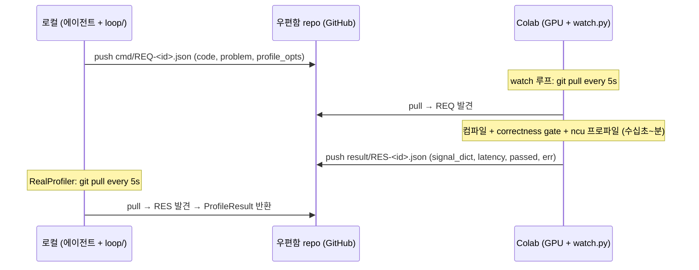

# Git-우편함 Runner — 비동기 GPU 실행 채널

> 🧭 자동 루프의 **Runner 컴포넌트** 설계. 터널·SSH·URL복붙 전부 제거.
> 로컬(에이전트)과 Colab(GPU)이 **git repo를 우편함**으로 cmd/result JSON 교환.
> 근거: [[2026-06-22-agentic-gpu-optimizer-design]] §2 컴포넌트3(Profiler/Submit). [[01-hard-loop-poc]] 터널 운용 교훈.

## 왜 (선택 기록)

이전 = cloudflared SSH 터널 + `colabrun` 래퍼. 3가지 고통:
1. **터널 끊김 로그 노이즈** — cloudflared 경고가 stdout 오염 (실제 끊김은 드묾, 로그만 거슬림).
2. **세션마다 새 URL 복붙** — Colab 재시작 → 새 trycloudflare URL → `~/.ssh/config` 수동 갱신.
3. **배포 불가** — 터널 셋업·URL은 개인 환경 종속. "남들도 쓰는 방법"이 목표라 부적합. Drive 마운트도 보안상 기각.

→ **B+ 결정**: 자동 루프 채널은 git 우편함(비동기). 수동 탐색은 ssh 별도 병존(선택).

### 기각된 대안

| 대안 | 기각 이유 |
|---|---|
| A+ (터널 유지 + URL 자동주입) | 터널 끊김 잔존. URL 자동화해도 터널 셀 살아야. 배포 시 터널 셋업 전파 부담. |
| Drive 파일 폴링 | 개인 Drive 로컬 마운트 = 보안 이슈 + 배포 불가. |
| named tunnel (고정 URL) | Cloudflare 계정·도메인 필요 = 배포 장벽. |

## 핵심 통찰

- **"연결"이 없음.** 실시간 ssh 세션 부재 → "끊김" 개념 소멸. 우편함에 편지 넣고 상대가 확인하는 시차만 존재.
- **즉답성 손실 ≈ 0.** 라운드 본체(컴파일+ncu+벤치) = 수십초~분. 폴링 지연 = ≤폴링간격(5s). 비율상 무시.
- **Colab watch = 새 부담 아님.** 터널 방식도 Colab 셀(터널) 켜둬야 함. watch 셀로 바뀔 뿐 = 순증 0. watch가 셀을 active 유지 → 유휴 90분 끊김 오히려 **방지** (12h 한계만 남음).

## 아키텍처



### 우편함 repo 레이아웃 (코드 repo와 분리)

```
gpu-mailbox/              # 별도 repo. loop/ 코드와 안 섞음.
  cmd/      REQ-<uuid>.json     # 로컬이 push, Colab이 소비
  result/   RES-<uuid>.json     # Colab이 push, 로컬이 소비
  done/     <uuid>              # 처리완료 마커 (재처리 방지)
  .gitignore
```

분리 이유: 코드 repo에 수백 개 cmd/result JSON 커밋 → 히스토리 오염. 우편함은 **휘발성 메시지큐**, 코드는 영속. 생명주기 다름 → repo 분리.

### 메시지 스키마

```jsonc
// cmd/REQ-<uuid>.json  (로컬 → Colab)
{
  "id": "<uuid>",
  "problem": "llama_ffn",          // challenge 식별자
  "code": "<생성된 커널 소스>",
  "code_hash": "ab12cd34ef",
  "profile_opts": {"ncu": true, "metrics": ["sm__throughput", "dram__throughput"]}
}

// result/RES-<uuid>.json  (Colab → 로컬)
{
  "id": "<uuid>",
  "passed": true,                  // correctness gate
  "max_abs_err": 3.1e-6,
  "signal_dict": {"bw_pct": 0.48, "weight_pct": 0.027, "tensorcore_active": true, "latency_us": 857.0},
  "latency_us": 857.0,
  "error": null                    // 컴파일/런타임 실패 시 메시지
}
```

`signal_dict` = `signals.from_dict` 입력과 동일 계약 → 기존 Trace Parser·Hypothesis Engine 그대로 소비.

## 컴포넌트 매핑 (glue.py)

`glue.py`의 3 Protocol = 우편함이 채움:

| Protocol | FakeGlue (현재) | 우편함 구현 |
|---|---|---|
| `Generator.generate` | 스크립트 | `RealGenerator` (LLM API, 로컬측 — 우편함 무관) |
| `Gate.check` | 스크립트 | Colab측 watch가 reference_impl 비교 → result.passed |
| `Profiler.profile` | 스크립트 | **`MailboxProfiler`** ← 핵심. 아래 |

```python
# 로컬측. glue.Profiler 구현. code → REQ push → RES pull → ProfileResult.
class MailboxProfiler:
    def __init__(self, mailbox_dir, poll_s=5, timeout_s=600):
        self.mb, self.poll, self.timeout = mailbox_dir, poll_s, timeout_s

    def profile(self, code, problem) -> ProfileResult:
        rid = uuid4().hex
        _write(self.mb/"cmd"/f"REQ-{rid}.json", {...code, problem...})
        _git(self.mb, "add -A && commit -qm req && push -q")
        res = self._await_result(rid)        # poll git pull until RES-<rid> appears
        return ProfileResult(res["signal_dict"], res["latency_us"])
```

Gate도 같은 RES에 실어 옴(passed/max_abs_err) → 별도 왕복 불필요. 1 cmd = 1 result에 gate+profile 합침.

## 보안 / 배포

- **PAT scope = repo 한정.** 로컬·Colab 양쪽 PAT 필요. Colab은 **Colab Secrets**에 저장(노출 안 됨). Drive 마운트 불요.
- **배포 = repo fork 1개.** 사용자가 빈 우편함 repo 1개 만들고 양쪽에 PAT 꽂으면 끝. 개인 환경 종속 0.
- 우편함 repo private 권장(생성 커널 코드 노출 방지).

## 미해결 / 다음

- [ ] `watch.py` (Colab측) — git pull 루프 + 컴파일/gate/ncu 실행 + result push. (실제 GPU 필요, Colab서 작성)
- [ ] `MailboxProfiler` (로컬측) — glue.py에 추가. **GPU 없이 단위테스트 가능** (가짜 우편함 = 로컬 폴더 2개로 push/pull 모킹).
- [ ] PAT 주입 방식 표준화 (env var `GPU_MAILBOX_TOKEN`).
- [ ] 타임아웃/재시도 정책 (Colab 죽으면 RES 안 옴 → timeout_s 후 에러 → 라운드 스킵 or 재큐).
- [ ] git 충돌 회피 — 양쪽이 다른 디렉토리(cmd/ vs result/)만 써서 머지충돌 구조적 없음. 확인 필요.

## 의사결정 여정 (이 설계에 도달한 과정)

> 결론(위)만으론 "왜 터널 안 고치고 버렸나"가 안 보임. 논의 순서 기록 = 미래의 나/타인이 같은 길 재탐색 안 하도록.

### 1단계 — 터널 끊김 = 진짜 문제인가?

최초 신고: "cloudflared 터널 자주 끊김 + 세션마다 URL 복붙 귀찮음."

**스코프 먼저**(ponytail 사다리: 문제 존재 확인 → 한 줄로 되나 → 그제서야 재설계). 끊김 종류 구분:
- 터널만 죽음(런타임·변수 생존) vs 런타임 죽음(전체 사망). 구분 테스트 = `colabrun "echo alive && nvidia-smi -L"` 즉답이면 둘 다 생존.

**판명**: 런타임 안 죽음. 터널도 사실상 안 죽음. 너가 본 "끊김 로그" = **내가 ssh 돌릴 때 뜬 cloudflared 재연결 경고 메시지**(stdout 오염), 실측 지연 0 = **노이즈 로그**. → 진짜 고통 = ① 로그 노이즈 ② URL 복붙. 끊김 자체는 환상에 가까움.

### 2단계 — A안(터널 유지)으로 충분한가?

A안 = 로그 stderr 격리(몇 줄) + URL 자동주입(Drive 파일 읽기). 둘 다 **기술적으론 됨**.

**기각 이유 = 배포·보안**:
- 이건 나만의 프로젝트 아님 = **남들도 쓰는 방법**이 목표. URL 자동화를 Drive 마운트로 풀면 → 개인 Google Drive를 각 사용자 머신에 연결 = **보안 이슈 + 배포 불가**.
- 터널 자체가 배포 부적합: quick tunnel = URL 동적, named tunnel = 계정·도메인 필요 = 진입장벽.

→ A안은 개인용 미봉책. 배포 목표와 충돌.

### 3단계 — "GitHub SSH로 대체?" 혼동 해소 (중요)

여기서 개념 혼선 발생. **"GitHub SSH는 터널 제공 안 한다던데?"** → 맞는 말이나 무관함. 두 개념이 섞임:

| | 무엇 | 내 우편함 방안과 관계 |
|---|---|---|
| **Git-over-SSH** (`ssh git@github.com`) | git push/pull 전송 프로토콜. 셸·터널 아님. | 우편함이 이걸 씀 (단순 전송) |
| **SSH 터널링** (cloudflared→Colab) | 원격 머신에 실시간 셸 진입. | 우편함은 이걸 **안 씀** (제거 대상) |

```
[터널 방식]  로컬 --ssh터널--> Colab       (실시간 연결, 끊김 가능)
[우편함]     로컬 --git push--> GitHub <--git pull-- Colab   (비동기, 연결 없음)
```

핵심: **우편함은 GitHub를 "우편함"으로만 씀** — cmd/result JSON 오가는 메시지큐. 실시간 ssh 연결이 아예 없음 → "GitHub가 터널 제공하냐"는 질문 자체가 무관. "끊김"이란 개념이 소멸하는 이유 = 연결이 없어서.

### 4단계 — 비동기 = 문제 안 되나? watch 부담은?

우려: ① 즉답 아니면 문제 ② Colab watch 셀 부담.

- **① 즉답 손실 ≈ 0**: 라운드 본체(컴파일+ncu+벤치)=수십초~분. 폴링 지연 = ≤폴링간격(5s), 라운드당 2군데(cmd집어듦+result집어듦). 비율상 무시. 즉답 필요한 건 인터랙티브 디버깅뿐 → 그건 ssh 따로(B+의 "병존").
- **② watch = 새 부담 아님**: 터널 방식도 Colab 셀(터널) 켜둬야 함. watch 셀로 바뀔 뿐 = 순증 0. watch가 셀을 active 유지 → 유휴 90분 끊김 **방지**(12h 한계만 남음).

→ **B+ 확정**: 자동 루프 = git 우편함(비동기). 수동 탐색 = ssh 병존. 둘 안 싸움.

### 기각 대안 (재확인)

위 §"기각된 대안" 표 참조. A+(터널+URL자동) / Drive폴링 / named tunnel 전부 배포·보안서 탈락.

## 링크

- [[2026-06-22-agentic-gpu-optimizer-design]] §2 (Runner = 컴포넌트3)
- [[01-hard-loop-poc]] (터널 운용 → 이 설계의 동기)
- [[GPU-Solver-MOC]]
