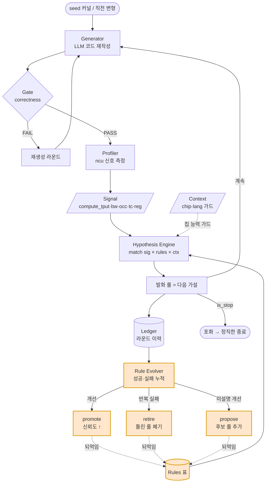
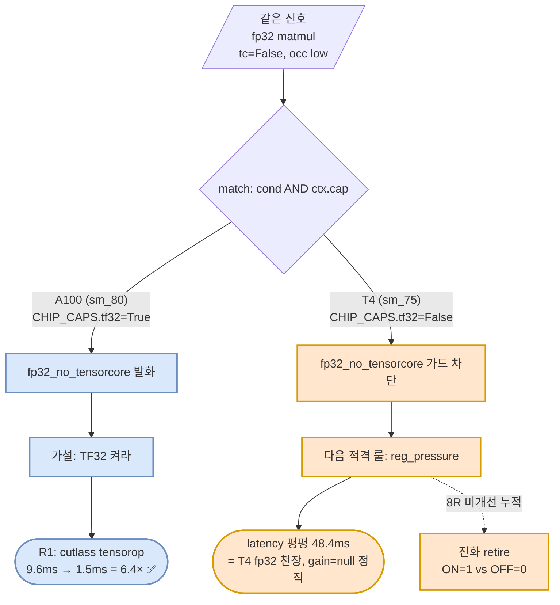

# 09 — 아키텍처 다이어그램 (Mermaid)

> 🎯 [[08-visualization-ideas]] ④루프흐름 + ③칩가드 제작분.
> Mermaid = vault 렌더 + GitHub README ```mermaid 네이티브 렌더 (양쪽 재사용, 의존성 0).
> 코드 출처: `loop/harness.py`(run_loop), `loop/rules.py`(match), `loop/signals.py`(CHIP_CAPS).

## ① 루프 아키텍처 — 측정→가설→재작성→진화 메타루프

한 라운드 = generate→gate→profile→match(가설)→ledger→evolve. **차별점 = evolve가 rules를
되먹임**(retire/propose) = 룰표가 측정으로 진화. 선행(CUDAMaster 등)은 이 되먹임 화살표가 없음(정적).



> 🟠 주황 = 차별점 (룰 진화 되먹임). CUDAMaster·KernelAgent 등 선행은 `rules`로 가는 점선 화살표 없음.

## ② 칩 가드 — 같은 신호, 칩 따라 다른 룰 발화

동일 fp32 matmul 신호라도 **칩 능력(CHIP_CAPS)이 헛가설을 사전 차단.** A100=TF32 가능→
`fp32_no_tensorcore` 발화(텐서코어로 6.4× gain). T4=TF32 없음(sm_75)→가드 차단→다음 적격 룰
`reg_pressure`. **= 환경을 룰 1급 입력으로** (07 설계). 실측 입증(2026-06-30).



> **이중 방어**: 칩 가드 = 알려진 헛가설(TF32 on non-TF32 chip) **사전 차단**(선언적, CHIP_CAPS) +
> 진화 retire = 모르는 헛가설 **사후 폐기**(측정 누적). 한 환경(T4)서 동시 관찰.

## 사용처

- **GitHub README**: 위 ```mermaid 블록 그대로 복붙 → GitHub 자동 렌더.
- **vault**: 이 노트가 곧 렌더 (옵시디언 Mermaid 네이티브).
- 수치 차트(gain 막대·retire 곡선)는 [[08-visualization-ideas]] ①② = PNG/HTML 별도 (미정).

## 링크
- [[08-visualization-ideas]] — 전체 시각화 후보·도구 비교
- [[07-chip-lang-context-design]] — ② 칩 가드 설계·실측 출처
- [[05-portfolio-differentiator]] — 차별점 서술
- [[PROGRESS]] — 진행 현황
